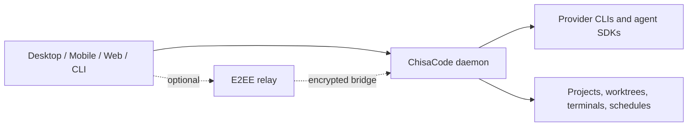

<p align="center">
  
</p>

<h1 align="center">ChisaCode</h1>

<p align="center"><strong>Run AI coding agents from desktop, mobile, web, and CLI.</strong></p>

> Languages: **English** | [简体中文](README.zh-CN.md)

<p align="center">
  <a href="https://github.com/ChisaAlter/ChisaCode/releases">Releases</a>
  ·
  <a href="https://github.com/ChisaAlter/ChisaCode/actions/workflows/ci.yml">CI</a>
  ·
  <a href="docs/cli.md">CLI</a>
  ·
  <a href="docs/skills.md">Skills</a>
</p>

---

ChisaCode is a local-first control surface for AI coding agents. It runs a daemon
on your machine, starts provider CLIs in your real development environment, and
lets multiple clients control the same work from a desktop app, phone, browser,
or terminal.

Use it when you want to run several agents in parallel, keep work in isolated
worktrees, check progress from another device, or give other agents a safe way
to delegate work through ChisaCode.

## What You Get

- **Local-first agent runtime**: code, credentials, shells, and agent processes
  stay on the daemon host.
- **One UI for many providers**: Claude Code, Codex, GitHub Copilot, OpenCode,
  MiMoCode, Pi, ACP-compatible providers, and custom provider definitions.
- **Cross-device sessions**: desktop, mobile, web, and CLI clients can connect to
  the same daemon and see the same agents.
- **Worktree-based parallelism**: create isolated git worktrees for independent
  tasks without disturbing the main checkout.
- **Agent delegation**: injected ChisaCode MCP tools let a parent agent delegate
  to child agents, inspect their status, cancel them, or collect results.
- **Schedules and loops**: run recurring checks through schedules, or use skills
  for long-running iteration with explicit exit conditions.
- **Voice and speech support**: dictate prompts, use voice mode, and choose local
  or configured speech providers.
- **Model routing and custom gateways**: configure custom providers, model
  gateways, and synthetic model-of-agents routing from settings.
- **Privacy-aware defaults**: no forced cloud account, no telemetry requirement,
  and no inference markup from ChisaCode.

## How It Works



The daemon owns long-lived state: agents, logs, workspaces, terminals, schedules,
provider settings, pairing, and relay connections. Clients are control surfaces.
Agents continue running when a client closes, and another client can reconnect
to the same daemon later.

## Quick Start

### 1. Install an Agent Provider

Install and authenticate at least one provider CLI or runtime:

- [Claude Code](https://docs.anthropic.com/en/docs/claude-code)
- [Codex](https://github.com/openai/codex)
- [GitHub Copilot CLI](https://github.com/features/copilot/cli/)
- [OpenCode](https://github.com/opencode-ai/opencode)
- [MiMoCode](https://github.com/XiaomiMiMo/MiMo-Code)
- [Pi](https://pi.dev)

Provider credentials remain managed by the provider tools themselves. ChisaCode
starts them and coordinates their sessions.

### 2. Use the Desktop App

Download a release from
[GitHub Releases](https://github.com/ChisaAlter/ChisaCode/releases). The desktop
app can start and supervise its own daemon, install the matching CLI, and install
the bundled ChisaCode skills from Settings.

To connect from a phone or another browser client, open Settings and scan the
pairing QR code.

### 3. Use the CLI or a Headless Machine

For a terminal-only setup:

```bash
npm install -g @chisacode/cli
chisacode daemon start
chisacode daemon status
```

Start agents and follow them from the shell:

```bash
chisacode provider ls
chisacode run --provider codex "fix the failing login test"
chisacode run --provider claude --worktree fix-login "implement the fix and add tests"

chisacode ls -a -g
chisacode attach <agent-id>
chisacode send <agent-id> "also update the docs"
chisacode wait <agent-id>
```

Connect to a daemon on another machine:

```bash
chisacode --host workstation.local:6767 ls -a
```

See the [CLI guide](docs/cli.md) for agent, provider, worktree, schedule, loop,
chat, terminal, and daemon commands.

## Skills

ChisaCode ships skills that teach supported agents how to use ChisaCode itself.
Install them from the desktop Settings page, or manually:

```bash
npx skills add ChisaAlter/ChisaCode
```

Core skills:

- `chisacode`: reference skill for creating agents, managing worktrees, sending
  prompts, and checking daemon state.
- `chisacode-advisor`: ask one separate agent for a second opinion.
- `chisacode-committee`: ask two contrasting agents to analyze a problem.
- `chisacode-handoff`: transfer work to another agent with context.
- `chisacode-loop`: repeat work until explicit acceptance criteria pass.
- `chisacode-epic`: run a large multi-phase orchestration flow.

See the [skills guide](docs/skills.md) for usage and operational notes.

## Developer Setup

This repository is an npm workspace monorepo. Use the Node version from
`.tool-versions`.

```bash
npm ci
npm run dev        # macOS/Linux
npm run dev:win    # Windows
```

Focused development commands:

```bash
npm run dev:server
npm run dev:app
npm run dev:desktop

npm run build:client
npm run build:server
npm run build:desktop

npm run typecheck
npm run lint
```

Useful architecture entry points:

- [Product overview](docs/product.md)
- [Architecture map](docs/ARCHITECTURE_MAP.md)
- [Development guide](docs/development.md)
- [Release guide](docs/release.md)
- [Custom providers](docs/custom-providers.md)
- [Security policy](SECURITY.md)

## Packages

| Package                         | Responsibility                                                  |
| ------------------------------- | --------------------------------------------------------------- |
| `@chisacode/protocol`           | Wire schemas, shared types, binary frame codecs                 |
| `@chisacode/client`             | Daemon WebSocket driver and SDK facade                          |
| `@chisacode/server`             | Local daemon, provider runtime, storage, MCP, relay, schedules  |
| `@chisacode/app`                | Expo client for iOS, Android, web, and desktop renderer UI      |
| `@chisacode/desktop`            | Electron wrapper, packaged app integration, daemon supervision  |
| `@chisacode/cli`                | Terminal interface for daemon, agents, worktrees, and schedules |
| `@chisacode/relay`              | End-to-end encrypted relay transport                            |
| `@chisacode/highlight`          | Reusable syntax highlighting                                    |
| `@chisacode/expo-two-way-audio` | Native audio bridge for voice features                          |

## Release Notes

All workspaces share one version. See [CHANGELOG.md](CHANGELOG.md) for user-facing
changes and [the release guide](docs/release.md) for the current release process.

Stable releases publish npm packages for the public workspaces and attach desktop
and APK artifacts through GitHub Actions. Mobile store builds are handled by the
configured EAS release flow.

## License

AGPL-3.0-or-later
