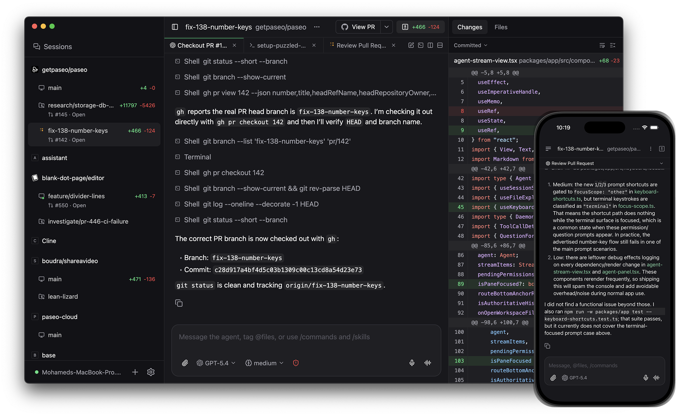
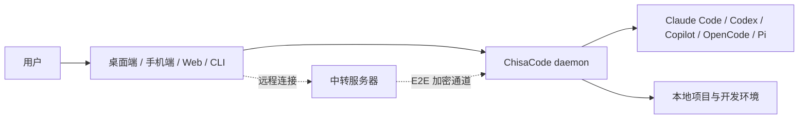

<p align="center">
  
</p>

<h1 align="center">ChisaCode</h1>

<p align="center"><strong>在电脑、手机和命令行里统一管理 AI 编程代理</strong></p>

> 语言：[English](README.md) | **简体中文**

<p align="center">
  <a href="https://github.com/ChisaAlter/ChisaCode/releases">发布版本</a>
  ·
  <a href="https://github.com/ChisaAlter/ChisaCode/actions/workflows/ci.yml">CI</a>
  ·
  <a href="README.md">English README</a>
</p>

<p align="center">
  
</p>

<p align="center">
  
</p>

---

ChisaCode 是一个本地优先的 AI 编程工作台。它在你的电脑上启动一个 daemon，
由 daemon 管理 Claude Code、Codex、GitHub Copilot、OpenCode、Pi 等代理进程，
再让桌面端、手机端、网页端和 CLI 通过同一套界面连接并控制这些代理。

你可以在电脑上启动任务，在手机上查看进度、发送后续指令、审批权限请求，或者从
命令行把代理接入自动化流程。

## 功能特性

- **本地优先**：代理运行在你自己的机器上，直接使用你的项目、环境变量、工具链和账号配置
- **多代理统一入口**：同一个界面管理 Claude Code、Codex、Copilot、OpenCode、Pi 等代理
- **跨设备协作**：桌面端、手机端、网页端和 CLI 都能连接同一个 daemon
- **并行任务**：同时启动多个代理，让它们在不同工作树或目录中处理独立任务
- **语音控制**：支持语音输入和语音模式，适合移动端或不方便打字时使用
- **远程连接**：支持通过中转服务器连接家里或办公室的 daemon，无需直接暴露本机端口
- **隐私友好**：默认没有遥测、跟踪或强制登录；代码和代理进程留在你的环境里

## 工作方式



daemon 是核心服务：它负责启动代理、保存会话、转发终端输出、处理权限请求和生成配对二维码。
客户端只负责展示和交互。手机端通过扫码配对后，可以直接连局域网 daemon，也可以通过中转服务器连回你的机器。

## 快速开始

### 1. 准备代理 CLI

至少安装并配置一个你要使用的代理 CLI：

- [Claude Code](https://docs.anthropic.com/en/docs/claude-code)
- [Codex](https://github.com/openai/codex)
- [GitHub Copilot CLI](https://github.com/features/copilot/cli/)
- [OpenCode](https://github.com/anomalyco/opencode)
- [Pi](https://pi.dev)

这些工具的登录和 API Key 配置仍然由各自 CLI 管理。ChisaCode 只负责启动和编排它们。

### 2. 使用桌面端

桌面端是最简单的入口。安装并打开 ChisaCode 后，daemon 会自动启动。

在桌面端设置页里打开配对二维码，用手机端扫描即可连接。手机和电脑在同一局域网时会优先直连；
不在同一网络时，可以通过中转服务器连接。

### 3. 使用 CLI / 服务器模式

也可以只安装 CLI，在没有桌面的服务器或远程机器上启动 daemon：

```bash
npm install -g @chisacode/cli
chisacode
```

启动后终端会显示配对二维码。用手机端或网页端扫码即可连接。

常用 CLI 示例：

```bash
chisacode run --provider claude/opus-4.6 "实现登录功能"
chisacode run --provider codex/gpt-5.4 --worktree feature-x "补齐测试"

chisacode ls
chisacode attach abc123
chisacode send abc123 "顺手把边界情况也测一下"
```

## 本地开发

本仓库是 npm workspace monorepo。请使用 Node 22，并用 `npm ci` 安装依赖。

```bash
npm ci

# 启动所有主要开发服务
npm run dev

# Windows 上启动所有主要开发服务
npm run dev:win
```

常用开发命令：

```bash
npm run dev:server
npm run dev:app
npm run dev:desktop
npm run dev:website

npm run build:server
npm run build:desktop

npm run typecheck
npm run lint
```

## 包结构

| 包                    | 说明                                                         |
| --------------------- | ------------------------------------------------------------ |
| `@chisacode/server`   | daemon、本地 WebSocket API、MCP 服务、代理生命周期管理       |
| `@chisacode/protocol` | 客户端和 daemon 共用的协议类型、消息 schema 和二进制帧编解码 |
| `@chisacode/client`   | 连接 daemon 的客户端 SDK                                     |
| `@chisacode/app`      | Expo 客户端，覆盖 iOS、Android、Web 和桌面渲染 UI            |
| `@chisacode/desktop`  | Electron 桌面壳，负责桌面端安装包和本地 daemon 管理          |
| `@chisacode/cli`      | 命令行入口，用于启动 daemon、创建任务、连接会话              |
| `@chisacode/relay`    | 端到端加密中转服务，用于跨网络连接 daemon                    |
| `@chisacode/website`  | 官网和公开文档站点                                           |

## 打包

### 桌面端

```bash
npm run build:desktop
```

Windows 构建产物会输出到桌面包的 `release` 目录。macOS 安装包通常需要在 macOS 环境或 GitHub Actions 中构建。

### Android

本地调试包：

```bash
cd packages/app/android
./gradlew :app:assembleDebug
```

生产 APK 推荐使用 EAS 的 `production-apk` profile，或者通过 GitHub Actions 的 Android APK Release 工作流生成。

## 自托管中转服务器

ChisaCode 可以通过中转服务器连接不在同一网络里的 daemon。中转通道只负责转发加密数据，
业务内容由客户端和 daemon 端到端加密。

如果中转服务器在本机或内网监听，公网入口由 nginx 提供 TLS，可以这样启动 daemon：

```bash
CHISACODE_RELAY_ENDPOINT=127.0.0.1:8080 \
CHISACODE_RELAY_PUBLIC_ENDPOINT=relay.example.com:443 \
CHISACODE_RELAY_USE_TLS=false \
CHISACODE_RELAY_PUBLIC_USE_TLS=true \
chisacode daemon start
```

等价配置：

```json
{
  "daemon": {
    "relay": {
      "enabled": true,
      "endpoint": "127.0.0.1:8080",
      "publicEndpoint": "relay.example.com:443",
      "useTls": false,
      "publicUseTls": true
    }
  }
}
```

最小 nginx WebSocket 反向代理示例：

```nginx
server {
  listen 443 ssl;
  server_name relay.example.com;

  ssl_certificate /etc/letsencrypt/live/relay.example.com/fullchain.pem;
  ssl_certificate_key /etc/letsencrypt/live/relay.example.com/privkey.pem;

  location /ws {
    proxy_pass http://127.0.0.1:8080;
    proxy_http_version 1.1;
    proxy_set_header Upgrade $http_upgrade;
    proxy_set_header Connection "upgrade";
    proxy_set_header Host $host;
  }
}
```

## 贡献

提交前建议至少运行：

```bash
npm run typecheck
npm run lint
```

如果只改了某个测试文件，请优先运行对应的定向测试，不要在本地反复跑完整重型测试套件。

## 许可证

AGPL-3.0-or-later
