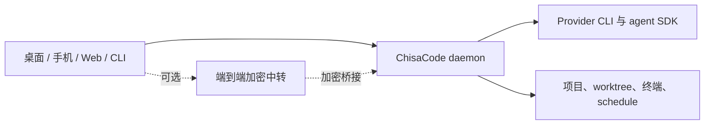

<p align="center">
  
</p>

<h1 align="center">ChisaCode</h1>

<p align="center"><strong>在桌面、手机、网页和命令行统一运行 AI 编程代理。</strong></p>

> 语言：[English](README.md) | **简体中文**

<p align="center">
  <a href="https://github.com/ChisaAlter/ChisaCode/releases">发布版本</a>
  ·
  <a href="https://github.com/ChisaAlter/ChisaCode/actions/workflows/ci.yml">CI</a>
  ·
  <a href="docs/cli.md">CLI</a>
  ·
  <a href="docs/skills.md">Skills</a>
</p>

---

ChisaCode 是一个本地优先的 AI 编程代理控制台。它在你的机器上运行 daemon，
由 daemon 启动真实开发环境里的 provider CLI 或 SDK，再让桌面端、手机端、
网页端和 CLI 连接到同一批 agent。

适合这些场景：同时跑多个 agent、把不同任务放进隔离 worktree、从手机查看进度、
给正在工作的 agent 追加指令，或者让一个 agent 通过 ChisaCode 安全地委派另一个 agent。

## 主要能力

- **本地优先运行时**：代码、凭据、shell 和 agent 进程留在 daemon 所在机器。
- **多 provider 统一入口**：支持 Claude Code、Codex、GitHub Copilot、OpenCode、
  MiMoCode、Pi、ACP 兼容 provider，以及自定义 provider。
- **跨设备会话**：桌面、手机、网页和 CLI 可以连接同一个 daemon，看见同一批 agent。
- **Worktree 并行开发**：为独立任务创建隔离 git worktree，不干扰主 checkout。
- **Agent 委派**：注入 ChisaCode MCP 工具后，父 agent 可以创建子 agent、查询状态、
  取消任务并读取结果。
- **定时任务和循环**：用 schedule 做周期性检查；用 skills 围绕验收条件做长循环。
- **语音和转写**：支持语音输入、语音模式，以及本地或配置化的 speech provider。
- **模型路由和自定义网关**：可以在设置里配置自定义 provider、model gateway 和
  synthetic model-of-agents 路由。
- **隐私友好默认值**：不强制云账号、不要求遥测，也不向推理调用加 ChisaCode 额外费用。

## 工作方式



daemon 持有长期状态：agent、日志、workspace、终端、schedule、provider 设置、配对和
relay 连接。客户端只是控制面。关闭一个客户端不会让 agent 停止，之后可以从另一个客户端继续连接。

## 快速开始

### 1. 安装至少一个 agent provider

先安装并登录至少一个 provider CLI 或运行时：

- [Claude Code](https://docs.anthropic.com/en/docs/claude-code)
- [Codex](https://github.com/openai/codex)
- [GitHub Copilot CLI](https://github.com/features/copilot/cli/)
- [OpenCode](https://github.com/opencode-ai/opencode)
- [MiMoCode](https://github.com/XiaomiMiMo/MiMo-Code)
- [Pi](https://pi.dev)

这些工具的登录状态和 API Key 仍由各自 provider 管理。ChisaCode 负责启动、编排和展示会话。

### 2. 使用桌面端

从 [GitHub Releases](https://github.com/ChisaAlter/ChisaCode/releases) 下载桌面端。
桌面端可以启动和托管自己的 daemon，也可以在 Settings 中安装匹配版本的 CLI 和内置 skills。

要连接手机或另一个浏览器客户端，打开 Settings 里的配对二维码并扫码。

### 3. 使用 CLI 或无桌面机器

如果只需要终端入口：

```bash
npm install -g @chisacode/cli
chisacode daemon start
chisacode daemon status
```

从命令行启动和跟进 agent：

```bash
chisacode provider ls
chisacode run --provider codex "修复失败的登录测试"
chisacode run --provider claude --worktree fix-login "实现修复并补测试"

chisacode ls -a -g
chisacode attach <agent-id>
chisacode send <agent-id> "顺手更新文档"
chisacode wait <agent-id>
```

连接另一台机器上的 daemon：

```bash
chisacode --host workstation.local:6767 ls -a
```

完整命令见 [CLI 文档](docs/cli.md)，覆盖 agent、provider、worktree、schedule、loop、
chat、terminal 和 daemon 操作。

## Skills

ChisaCode 自带一组 skills，用来教支持 skill 机制的 agent 如何使用 ChisaCode 本身。
推荐从桌面端 Settings 安装；也可以手动安装：

```bash
npx skills add ChisaAlter/ChisaCode
```

核心 skills：

- `chisacode`：创建 agent、管理 worktree、发送 prompt、检查 daemon 状态的基础参考。
- `chisacode-advisor`：启动一个独立 agent 给第二意见。
- `chisacode-committee`：启动两个视角不同的 agent 分析问题。
- `chisacode-handoff`：把上下文和任务交给另一个 agent 继续。
- `chisacode-loop`：围绕明确验收条件反复迭代。
- `chisacode-epic`：执行大型、多阶段、可恢复的编排流程。

使用方式和注意事项见 [Skills 文档](docs/skills.md)。

## 本地开发

本仓库是 npm workspace monorepo。请使用 `.tool-versions` 中指定的 Node 版本。

```bash
npm ci
npm run dev        # macOS/Linux
npm run dev:win    # Windows
```

常用开发命令：

```bash
npm run dev:server
npm run dev:app
npm run dev:desktop

npm run build:client
npm run build:server
npm run build:desktop

npm run typecheck
npm run lint
```

建议先读这些入口：

- [产品说明](docs/product.md)
- [架构地图](docs/ARCHITECTURE_MAP.md)
- [开发指南](docs/development.md)
- [发布指南](docs/release.md)
- [自定义 provider](docs/custom-providers.md)
- [安全策略](SECURITY.md)

## 包结构

| 包                              | 职责                                                      |
| ------------------------------- | --------------------------------------------------------- |
| `@chisacode/protocol`           | 线协议 schema、共享类型和二进制帧编解码                   |
| `@chisacode/client`             | daemon WebSocket 驱动和 SDK facade                        |
| `@chisacode/server`             | 本地 daemon、provider runtime、存储、MCP、relay、schedule |
| `@chisacode/app`                | Expo 客户端，覆盖 iOS、Android、Web 和桌面 renderer UI    |
| `@chisacode/desktop`            | Electron 壳、桌面安装包集成和 daemon 托管                 |
| `@chisacode/cli`                | daemon、agent、worktree、schedule 的命令行入口            |
| `@chisacode/relay`              | 端到端加密 relay transport                                |
| `@chisacode/highlight`          | 可复用语法高亮                                            |
| `@chisacode/expo-two-way-audio` | 语音功能使用的原生音频桥接                                |

## 版本更新

所有 workspace 共用一个版本号。用户可见变化见 [CHANGELOG.md](CHANGELOG.md)，发布流程见
[发布指南](docs/release.md)。

稳定版会发布公开 workspace 的 npm 包，并通过 GitHub Actions 附加桌面端和 APK 产物。
移动商店构建由配置好的 EAS 发布流程处理。

## 许可证

AGPL-3.0-or-later
